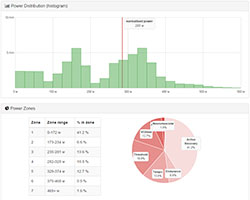
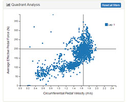
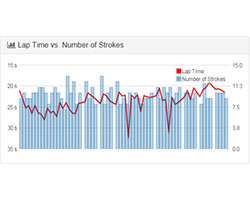

[](https://travis-ci.org/adriangibbons/php-fit-file-analysis) [](https://packagist.org/packages/adriangibbons/php-fit-file-analysis) [](https://packagist.org/packages/adriangibbons/php-fit-file-analysis) [](https://coveralls.io/github/adriangibbons/php-fit-file-analysis?branch=master)
# phpFITFileAnalysis

A PHP class for analysing FIT files created by Garmin GPS devices.

[Live demonstration](http://adriangibbons.com/php-fit-file-analysis/demo/) (Right-click and Open in new tab)

##Demo Screenshots





Please read this page in its entirety and the [FAQ](https://github.com/adriangibbons/php-fit-file-analysis/wiki/Frequently-Asked-Questions-(FAQ)) first if you have any questions or need support.

##What is a FIT file?
FIT or Flexible and Interoperable Data Transfer is a file format used for GPS tracks and routes. It is used by newer Garmin fitness GPS devices, including the Edge and Forerunner series, which are popular with cyclists and runners.

Visit the FAQ page within the Wiki for more information.

##How do I use phpFITFileAnalysis with my PHP-driven website?

A couple of choices here:

**The more modern way:** Add the package *adriangibbons/php-fit-file-analysis* in a composer.json file:
```JSON
{
    "require": {
        "adriangibbons/php-fit-file-analysis": "3.0.*"
    }
}
```
Run ```composer update``` from the command line.

The composer.json file should autoload the ```phpFITFileAnalysis``` class, so as long as you include the autoload file in your PHP file, you should be able to instantiate the class with:
```php
<?php
    require __DIR__ . '/vendor/autoload.php';  // this file is in the project's root folder
    $pFFA = new adriangibbons\phpFITFileAnalysis('fit_files/my_fit_file.fit');
?>
```

**The more manual way:** Download the ZIP from GitHub and put PHP class file from the /src directory somewhere appropriate (e.g. classes/). A conscious effort has been made to keep everything in a single file.

Then include the file on the PHP page where you want to use it and instantiate an object of the class:
```php
<?php
    include('classes/phpFITFileAnalysis.php');
    $pFFA = new adriangibbons\phpFITFileAnalysis('fit_files/my_fit_file.fit');
?>
```
Note that the only mandatory parameter required when creating an instance is the path to the FIT file that you want to load.

There are more **Optional Parameters** that can be supplied. These are described in more detail further down this page.

The object will automatically load the FIT file and iterate through its contents. It will store any data it finds in arrays, which are accessible via the public data variable.

###Accessing the Data
Data read by the class are stored in associative arrays, which are accessible via the public data variable:
```php
$pFFA->data_mesgs
```
The array indexes are the names of the messages and fields that they contain. For example:
```php
// Contains an array of all heart_rate data read from the file, indexed by timestamp
$pFFA->data_mesgs['record']['heart_rate']
// Contains an integer identifying the number of laps
$pFFA->data_mesgs['session']['num_laps']
```
**OK, but how do I know what messages and fields are in my file?**
You could either iterate through the $pFFA->data_mesgs array, or take a look at the debug information you can dump to a webpage:
```php
// Option 1. Iterate through the $pFFA->data_mesgs array
foreach ($pFFA->data_mesgs as $mesg_key => $mesg) {  // Iterate the array and output the messages
    echo "<strong>Found Message: $mesg_key</strong><br>";
    foreach ($mesg as $field_key => $field) {  // Iterate each message and output the fields
        echo " - Found Field: $mesg_key -> $field_key<br>";
    }
    echo "<br>";
}

// Option 2. Show the debug information
$pFFA->showDebugInfo();  // Quite a lot of info...
```
**How about some real-world examples?**
```php
// Get Max and Avg Speed
echo "Maximum Speed: ".max($pFFA->data_mesgs['record']['speed'])."<br>";
echo "Average Speed: ".( array_sum($pFFA->data_mesgs['record']['speed']) / count($pFFA->data_mesgs['record']['speed']) )."<br>";

// Put HR data into a JavaScript array for use in a Chart
echo "var chartData = [";
    foreach ($pFFA->data_mesgs['record']['heart_rate'] as $timestamp => $hr_value) {
        echo "[$timestamp,$hr_value],";
    }
echo "];";
```
**Enumerated Data**
The FIT protocol makes use of enumerated data types. Where these values have been identified in the FIT SDK, they have been included in the class as a private variable: $enum_data.

A public function is available, which will return the enumerated value for a given message type. For example:
```php
// Access data stored within the private class variable $enum_data
// $pFFA->enumData($type, $value)
// e.g.
echo $pFFA->enumData('sport', 2));  // returns 'cycling'
echo $pFFA->enumData('manufacturer', $this->data_mesgs['device_info']['manufacturer']);  // returns 'Garmin';
echo $pFFA->manufacturer();  // Short-hand for above
```
In addition, public functions provide a short-hand way to access commonly used enumerated data:

 - manufacturer()
 - product()
 - sport()

###Optional Parameters
There are three optional parameters that can be passed as an associative array when the phpFITFileAnalysis object is instantiated. These are:

 - fix_data
 - units
 - pace

For example:
```php
$options = [
    'fix_data'  => ['cadence', 'distance'],
    'units'     => 'statute',
    'pace'      => true
];
$pFFA = new adriangibbons\phpFITFileAnalysis('my_fit_file.fit', $options);
```
The optional parameters are described in more detail below.
####"Fix" the Data
FIT files have been observed where some data points are missing for one sensor (e.g. cadence/foot pod), where information has been collected for other sensors (e.g. heart rate) at the same instant. The cause is unknown and typically only a relatively small number of data points are missing. Fixing the issue is probably unnecessary, as each datum is indexed using a timestamp. However, it may be important for your project to have the exact same number of data points for each type of data.

**Recognised values:** 'all', 'cadence', 'distance', 'heart_rate', 'lat_lon', 'power', 'speed'

**Examples: **
```php
$options = ['fix_data' => ['all']];  // fix cadence, distance, heart_rate, lat_lon, power, and speed data
$options = ['fix_data' => ['cadence', 'distance']];  // fix cadence and distance data only
$options = ['fix_data' => ['lat_lon']];  // fix position data only
```
If the *fix_data* array is not supplied, then no "fixing" of the data is performed.

A FIT file might contain the following:

<table>
<thead>
<th></th>
<th># Data Points</th>
<th>Delta (c.f. Timestamps)</th>
</thead>
<tbody>
<tr>
<td>timestamp</td><td>10251</td><td>0</td>
</tr>
<tr>
<td>position_lat</td><td>10236</td><td>25</td>
</tr>
<tr>
<td>position_long</td><td>10236</td><td>25</td>
</tr>
<tr>
<td>altitude</td><td>10251</td><td>0</td>
</tr>
<tr>
<td>heart_rate</td><td>10251</td><td>0</td>
</tr>
<tr>
<td>cadence</td><td>9716</td><td>535</td>
</tr>
<tr>
<td>distance</td><td>10236</td><td>25</td>
</tr>
<tr>
<td>speed</td><td>10236</td><td>25</td>
</tr>
<tr>
<td>power</td><td>10242</td><td>9</td>
</tr>
<tr>
<td>temperature</td><td>10251</td><td>0</td>
</tr>
</tbody>
</table>

As illustrated above, the types of data most susceptible to missing data points are: position_lat, position_long, altitude, heart_rate, cadence, distance, speed, and power.

With the exception of cadence information, missing data points are "fixed" by inserting interpolated values.

For cadence, zeroes are inserted as it is thought that it is likely no data has been collected due to a lack of movement at that point in time.

**Interpolation of missing data points**
```php
// Do not use code, just for demonstration purposes
var_dump($pFFA->data_mesgs['record']['temperature']);  // ['100'=>22, '101'=>22, '102'=>23, '103'=>23, '104'=>23];
var_dump($pFFA->data_mesgs['record']['distance']);  // ['100'=>3.62, '101'=>4.01, '104'=>10.88];
```
As you can see from the trivial example above, temperature data have been recorded for each of five timestamps (100, 101, 102, 103, and 104). However, distance information has not been recorded for timestamps 102 and 103.

If *fix_data* includes 'distance', then the class will attempt to insert data into the distance array with the indexes 102 and 103. Values are determined using a linear interpolation between indexes 101(4.01) and 104(10.88).

The result would be:
```php
var_dump($pFFA->data_mesgs['record']['distance']);  // ['100'=>3.62, '101'=>4.01, '102'=>6.30, '103'=>8.59, '104'=>10.88];
```

####Set Units
By default, **metric** units (identified in the table below) are assumed.

<table>
<thead>
<th></th>
<th>Metric<br><em>(DEFAULT)</em></th>
<th>Statute</th>
<th>Raw</th>
</thead>
<tbody>
<tr>
<td>Speed</td><td>kilometers per hour</td><td>miles per hour</td><td>meters per second</td>
</tr>
<tr>
<td>Distance</td><td>kilometers</td><td>miles</td><td>meters</td>
</tr>
<tr>
<td>Altitude</td><td>meters</td><td>feet</td><td>meters</td>
</tr>
<tr>
<td>Latitude</td><td>degrees</td><td>degrees</td><td>semicircles</td>
</tr>
<tr>
<td>Longitude</td><td>degrees</td><td>degrees</td><td>semicircles</td>
</tr>
<tr>
<td>Temperature</td><td>celsius (&#8451;)</td><td>fahrenheit (&#8457;)</td><td>celsius (&#8451;)</td>
</tr>
</tbody>
</table>

You can request **statute** or **raw** units instead of metric. Raw units are those were used by the device that created the FIT file and are native to the FIT standard (i.e. no transformation of values read from the file will occur).

To select the units you require, use one of the following:
```php
$options = ['units' => 'statute'];
$options = ['units' => 'raw'];
$options = ['units' => 'metric'];  // explicit but not necessary, same as default
```
####Pace
If required by the user, pace can be provided instead of speed. Depending on the units requested, pace will either be in minutes per kilometre (min/km) for metric units; or minutes per mile (min/mi) for statute.

To select pace, use the following option:
```php
$options = ['pace' => true];
```
Pace values will be decimal minutes. To get the seconds, you may wish to do something like:
```php
foreach ($pFFA->data_mesgs['record']['speed'] as $key => $value) {
    $min = floor($value);
    $sec = round(60 * ($value - $min));
    echo "pace: $min min $sec sec<br>";
}
```
Note that if 'raw' units are requested then this parameter has no effect on the speed data, as it is left untouched from what was read-in from the file.

##Analysis
The following functions return arrays of that could be used to create tables/charts:
```php
array $pFFA->hrPartionedHRmaximum(int $hr_maximum);
array $pFFA->hrPartionedHRreserve(int $hr_resting, int $hr_maximum);
array $pFFA->powerPartioned(int $functional_threshold_power);
array $pFFA->powerHistogram(int $bucket_width = 25);
```
For advanced control over these functions, or use with other sensor data (e.g. cadence or speed), use the underlying functions:
```php
array $pFFA->partitionData(string $record_field='', $thresholds=null, bool $percentages = true, bool $labels_for_keys = true);
array $pFFA->histogram(int $bucket_width=25, string $record_field='');
```
Functions exist to determine thresholds based on percentages of user-supplied data:
```php
array $pFFA->hrZonesMax(int $hr_maximum, array $percentages_array=[0.60, 0.75, 0.85, 0.95]);
array $pFFA->hrZonesReserve(int $hr_resting, int $hr_maximum, array $percentages_array=[0.60, 0.65, 0.75, 0.82, 0.89, 0.94 ]) {
array $pFFA->powerZones(int $functional_threshold_power, array $percentages_array=[0.55, 0.75, 0.90, 1.05, 1.20, 1.50]);
```
###Heart Rate
A function exists for analysing heart rate data:
```php
// hr_FT is heart rate at Functional Threshold, or Lactate Threshold Heart Rate
array $pFFA->hrMetrics(int $hr_resting, int $hr_maximum, string $hr_FT, $gender);
// e.g. $pFFA->hrMetrics(52, 189, 172, 'male');
```
**Heart Rate metrics:**
 * TRIMP (TRaining IMPulse)
 * Intensity Factor

###Power
Three functions exist for analysing power data:
```php
array $pFFA->powerMetrics(int $functional_threshold_power);
array $pFFA->criticalPower(int or array $time_periods);  // e.g. 300 or [600, 900]
array $pFFA->quadrantAnalysis(float $crank_length, int $ftp, int $selected_cadence = 90, bool $use_timestamps = false);  // Crank length in metres
```
**Power metrics:**
 * Average Power
 * Kilojoules
 * Normalised Power (estimate had your power output been constant)
 * Variability Index (ratio of Normalised Power / Average Power)
 * Intensity Factor (ratio of Normalised Power / Functional Threshold Power)
 * Training Stress Score (effort based on relative intensity and duration)

**Critical Power** (or Best Effort) is the highest average power sustained for a specified period of time within the activity. You can supply a single time period (in seconds), or an array or time periods.

**Quadrant Analysis** provides insight into the neuromuscular demands of a bike ride through comparing pedal velocity with force by looking at cadence and power.

Note that ```$pFFA->criticalPower``` and some power metrics (Normalised Power, Variability Index, Intensity Factor, Training Stress Score) will use the [PHP Trader](http://php.net/manual/en/book.trader.php) extension if it is loaded on the server. If the extension is not loaded then it will use the built-in Simple Moving Average algorithm, which is far less performant particularly for larger files!

A demo of power analysis is available [here](http://adriangibbons.com/php-fit-file-analysis/demo/power-analysis.php).

##Other methods
Returns array of booleans using timestamp as key. true == timer paused (e.g. autopause):
```php
array isPaused()
```
Returns a JSON object with requested ride data:
```php
array getJSON(float $crank_length = null, int $ftp = null, array $data_required = ['all'], int $selected_cadence = 90)
/**
 * $data_required can be ['all'] or a combination of:
 * ['timestamp', 'paused', 'temperature', 'lap', 'position_lat', 'position_long', 'distance', 'altitude', 'speed', 'heart_rate', 'cadence', 'power', 'quadrant-analysis']
 */
```

##Acknowledgement
This class has been created using information available in a Software Development Kit (SDK) made available by ANT ([thisisant.com](http://www.thisisant.com/resources/fit)).

As a minimum, I'd recommend reading the three PDFs included in the SDK:

 1. FIT File Types Description
 2. FIT SDK Introductory Guide
 3. Flexible & Interoperable Data Transfer (FIT) Protocol

Following these, the 'Profile.xls' spreadsheet and then the Java/C/C++ examples.